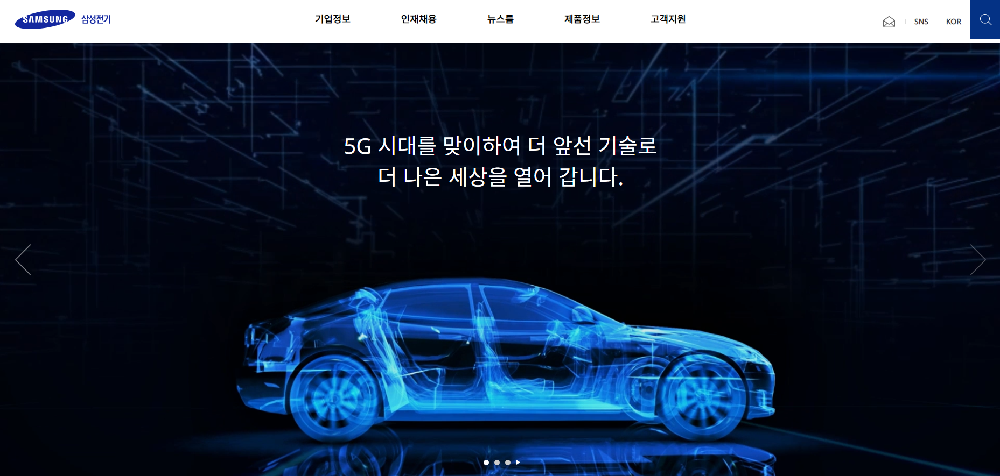
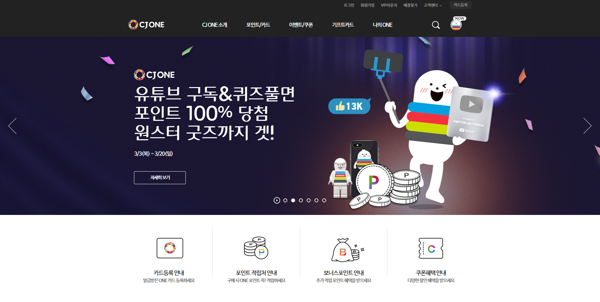

### Hi there 👋

___

#### 🛠Tech Stack🛠

___

#### ✨Me✨

### My Project

<table>
  <tbody>
    <tr>
      <td>
         
      </td>
      <td>
        
      </td>
      <td>
        
      </td>
    </tr>
  </tbody>
</table>

[> **More Project...**](https://github.com/dmswnlee?tab=repositories)

